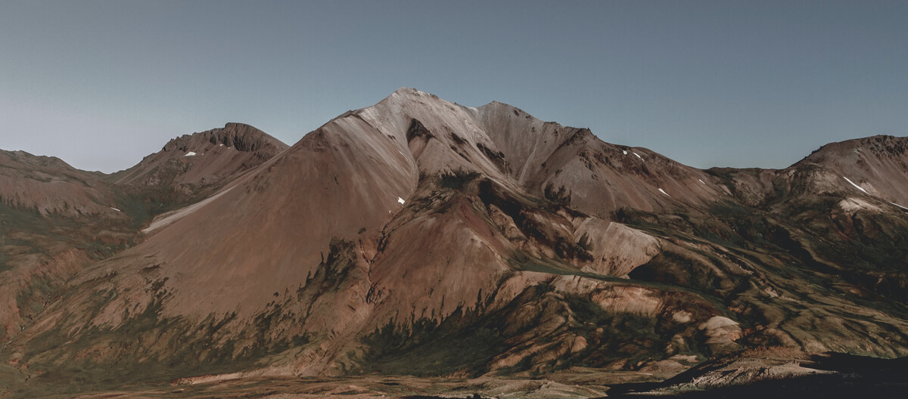

# OTESSA 2024 Program

## McGill University

[Docsify](https://docsify.js.org/#/) can generate article, portfolio and documentation websites on the fly. Unlike Docusaurus, Hugo and many other Static Site Generators (SSG), it does not generate static html files. Instead, it smartly loads and parses your Markdown content files and displays them as a website.

## Website Pages
- [Welcome](welcome.md)
- [Topic One](topic-one.md)
- [Topic Two](topic-two.md)
- Topic Three
    - [Overview](topic-three-overview.md)
    - [Subtopic One](topic-three-subtopic-one.md)
    - [Subtopic Two](topic-three-subtopic-two.md)

 3:30-4:00 Keynote  Invited Speaker Social Session